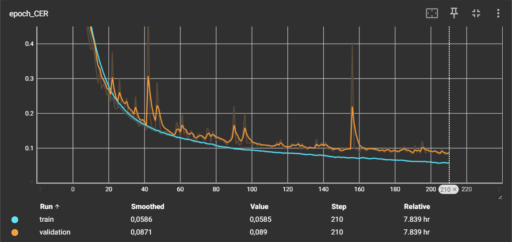
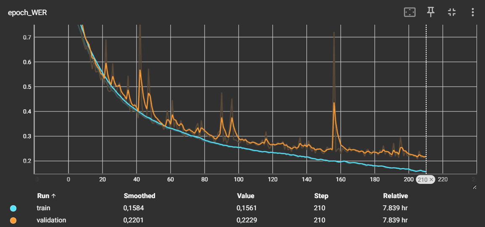

# Handwriting Recognition of Words using TensorFlow

This project focuses on creating a TensorFlow model for handwriting words recognition using custom library. The goal is to build a solution capable of extracting text from captcha images using the IAM Dataset, which includes images of handwritten text and corresponding text strings.

## About the model

The model architecture combines Convolutional Neural Networks (CNN) with Bidirectional Long Short-Term Memory (LSTM) layers. This architecture is effective for sequence labeling tasks like handwriting recognition. The model is trained using the Connectionist Temporal Classification (CTC) loss function and the Adam optimizer. Training progress is monitored using the Character Error Rate (CER) and Word Error Rate (WER) metrics. The trained model was evaluated using the CER metric on a validation dataset. 

## Results

Model reached 4% of CER on validation set.

